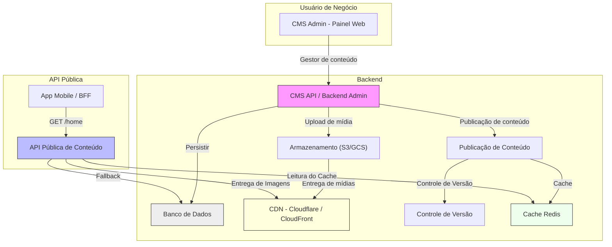

# Documentação Técnica – Sistema de Gerenciamento de Conteúdo da Home do App (Substituição do Oracle OCC)

✅ Visão Geral da Solução
------------------------

### 🎯 Objetivo:

Implementar um sistema que permita:
*   **Cadastro e gestão de conteúdo** da home do app (banners, categorias, ofertas etc.)
    
*   **Publicação controlada via API REST**
    
*   **Uso de CDN para entrega rápida de imagens**
    
*   **Versionamento e rollback de conteúdo**
    
*   **Painel administrativo para gestão de conteúdo**
    

* * *

🧩 Componentes da Solução
-------------------------

| Componente | Função |
| --- | --- |
| Painel Admin (CMS) | Interface para cadastro e gestão de conteúdo |
| Backend API (Content API) | CRUD de banners, categorias, ofertas etc. |
| Banco de Dados (SQL/NoSQL) | Armazena metadados dos conteúdos (ex: URL da imagem, links, etc.) |
| Armazenamento (ex: S3/GCS) | Armazena as imagens e arquivos (upload via CMS ou endpoint REST) |
| CDN (Cloudflare, AWS CloudFront) | Acelera entrega de imagens e ativos estáticos |
| API pública de conteúdo | Endpoint consumido pelo BFF ou app diretamente |
| Redis | Cache de conteúdo dinâmico (para home do app) |
| Versionamento de conteúdo | Guardar histórico para rollback se necessário |
| Sistema de publicação | Botão "publicar" para mover rascunhos para produção |
| Observabilidade | Logs, tracing, dashboard de erros (Datadog, Grafana, etc.) |

* * *
## Arquitetura - Sistema de Conteúdo da Home do App (Substituição do OCC)


* * *

🔧 Exemplo de Implementação Técnica
-----------------------------------

### 1. Painel CMS Customizado

*   Framework: React + Tailwind + Next.js ou AdminJS (Node)
    
*   Permite cadastrar banners, ofertas, categorias com preview
    
*   Upload de imagem → envia para bucket (S3, GCS)
    

### 2. API Backend (Content API)

*   Frameworks sugeridos:
    *   **Node.js (Express/Fastify)** com TypeORM/Mongoose
        
    *   **Python (FastAPI)** com SQLAlchemy ou MongoEngine
        
    *   **Java (Spring Boot)** com JPA
        
*   Endpoints:
    *   `GET /home` → retorna estrutura da home
        
    *   `POST /banners`, `GET /banners`, `PUT /banners/:id`
        
    *   `GET /categories`, etc.
        
    *   `POST /publish` → gera versão estática/cacheada da home
        

### 3. Armazenamento + CDN

*   Upload de imagem → salva no bucket
    
*   Armazena URL pública com CDN (exemplo: `https://cdn.gcb.com.br/images/banner-abc.jpg`)
    
*   CDN recomendado: Cloudflare, AWS CloudFront, GCP Cloud CDN
    

### 4. Estrutura de Dados (exemplo de um banner)

json

CopiarEditar

```json
{
    "id": "banner-123",
    "title": "Super Promoção",
    "imageUrl": "https://cdn.gcb.com.br/images/promo-1.jpg",
    "link": "/produto/456",
    "size": "medium",
    "position": "top",
    "active": true,
    "startDate": "2025-08-01T00:00:00Z",
    "endDate": "2025-08-10T23:59:59Z"
}
```

### 5. Versionamento e Publicação

*   Tabela `versions` que guarda snapshots da home
    
*   Cada "publicação" salva uma nova versão e atualiza o cache (Redis, por ex.)
    
*   Permite `rollback` via API
    

* * *

📦 Extra: Ferramentas & Infra
-----------------------------

| Função | Ferramenta recomendada |
| --- | --- |
| CMS Headless | Strapi, Sanity.io, Directus, Payload CMS |
| CDN | Cloudflare, AWS CloudFront, GCP Cloud CDN |
| Imagens otimizadas | ImageKit, imgproxy, Thumbor (on-prem) |
| Banco de dados | MongoDB (flexível) ou PostgreSQL |
| Cache | Redis, Varnish |
| API Gateway | Apigee, Kong, API Gateway (GCP/AWS) |
| Observabilidade | Grafana + Loki, Elastic, Datadog |

* * *

📈 Benefícios da Arquitetura Proposta
-------------------------------------

*   Conteúdo gerenciado por usuários de negócio (autonomia)
    
*   Cacheável, rápido e escalável
    
*   Desacoplamento entre app e origem de dados (corte do OCC)
    
*   Controle de versão + rollback
    
*   Menos dependência de deploys para alterar a home

---

## Fluxo de publicação e entrega de conteúdo



---

### 🔎 Explicação do Diagrama

- **Usuário de negócio** acessa o **CMS** para cadastrar e editar conteúdos da Home (banners, categorias etc.).
- As imagens são enviadas para um bucket de **armazenamento** (como S3 ou GCS).
- O CMS envia metadados para o banco de dados e chama o serviço de **Publicação**.
- No momento da publicação, o conteúdo ativo é salvo no Redis e pode ser versionado para rollback.
- A **API Pública** da Home é consumida pelo App (ou BFF) e retorna conteúdo diretamente do cache (com fallback no DB).
- As imagens são servidas via **CDN** para performance.

---

## Complementos Recomendados

🔐 1. Segurança e Controle de Acesso
------------------------------------

*   Autenticação via OAuth2 ou JWT para acesso ao CMS.
    
*   Controle de permissões (RBAC): ex: Admin, Conteudista, Visualizador.
    
*   Limitação de IP ou VPN para CMS (opcional).
    
*   Validação de payloads com schemas (ex: JSON Schema, OpenAPI).
    

* * *

🚀 2. Performance e Escalabilidade
----------------------------------

*   Uso de CDN para imagens e conteúdo estático reduz a latência.
    
*   Cache Redis para conteúdo publicado evita consultas frequentes ao banco.
    
*   Possibilidade de "pre-rendering" da Home e salvar no Redis como blob JSON.
    
*   Escalabilidade horizontal do CMS e da API pública (via Kubernetes, AppEngine, ECS).
    

* * *

🛠️ 3. DevOps e Deploy
----------------------

*   CI/CD com GitHub Actions, GitLab CI ou Cloud Build.
    
*   Ambientes separados: `dev`, `homolog`, `prod` com versionamento de conteúdo.
    
*   Deploy automatizado de CMS e APIs com rollback fácil.
    
*   Monitoramento de tempo de resposta das APIs (APM, Datadog, Prometheus).
    

* * *

🧪 4. Testes e Qualidade
------------------------

*   Testes unitários para API de conteúdo.
    
*   Testes de integração para publicação e leitura da Home.
    
*   Testes de carga com k6 ou Artillery para validar performance sob stress.
    
*   Validação de imagens e links expirados automaticamente (cron).
    

* * *

🧾 5. Governança e Versionamento
--------------------------------

*   Cada publicação gera um snapshot (hash/version-id).
    
*   Possibilidade de comparar versões publicadas vs. em edição.
    
*   Logs de quem publicou, quando e o quê.
    
*   API `GET /home?version=123` para debugging ou rollback.
    

* * *

🌎 6. Multicanal e Evolução
---------------------------

*   Estrutura pensada para suportar também o **site web** futuramente.
    
*   Dados estruturados para suporte a personalização ou A/B testing.
    
*   API pode evoluir para GraphQL se necessário, com resolvers sob demanda.

📂 7. Organização de Código (Recomendação)
------------------------------------------

📁 content-api/
│   ├── controllers/
│   ├── services/
│   ├── models/
│   ├── routes/
│   ├── middlewares/
│   └── index.js
📁 cms-frontend/
│   ├── components/
│   ├── pages/
│   ├── services/
│   └── public/ (upload direto ou via backend)

* * *

📊 8. Métricas Recomendadas
---------------------------

| Métrica | Como medir / ferramenta |
| --- | --- |
| Tempo médio de resposta da API | APM / Logs |
| Taxa de acerto do cache Redis | Prometheus ou Redis Insights |
| Taxa de erro de publicação | Logs de erro no backend |
| Conteúdos mais clicados | Google Analytics / Pixel de rastreamento |
| Histórico de versões ativas | Banco de dados (tabela de versionamento) |
